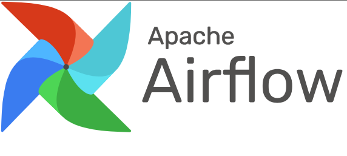
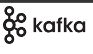

<h1 align="center">Hi 👋, I'm Mingma Moktan</h1>

<!-- 

  

 -->

  

### 🔭 About Me
- Student of **Data Engineering & AI** at Satakunta University of Applied Sciences  
- 💻 Currently learning **Apache Airflow , Kafka  , ETL pipelines, Python, and SQL**  
- Passionate about hands-on projects and learning new data engineering tools and frameworks  
- Open to internships and junior data engineering roles  

### 📫 Connect with Me

  
  
  

### 🛠 Languages & Tools

  <code></code>
  <code></code>
  <code></code>
  <code></code>
  <code></code>
  <code></code>
  <code></code>
  <code></code>
  <code></code>
  <code></code>
  <code></code>
  <code></code>
  <code></code>
  <code></code>
  <code></code>
  <code></code>

## Featured Projects

### [ETL Project 1](https://github.com/MingmaMoktan/ETL_Project_1)

  
  
  

Data extraction, cleaning, and loading pipeline using Python and SQL.

---

### [Automated Backup Script](https://github.com/MingmaMoktan/Automated_backup_script)

  
  
  

A shell-based automated backup solution for scheduled file archiving.

---

### [Spotify Clone](https://github.com/MingmaMoktan/Spotify_clone)

  
  
  

A UI clone of Spotify built using web technologies.

---

### [My Python Projects](https://github.com/MingmaMoktan/My_Py_Projects)

  
  
  

A collection of Python scripts, experiments, and mini-projects.

> Explore all my repositories at [my GitHub profile](https://github.com/MingmaMoktan/Mingma-Moktan)